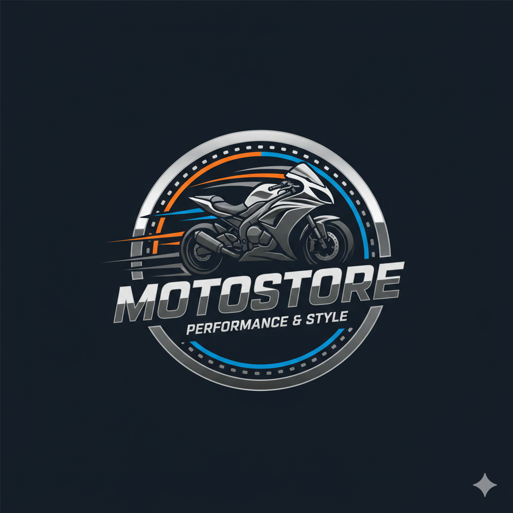

¡Excelente idea 🚀! Te armo un **README.md** bien explicado para tu proyecto de la página web con login y home en Node.js + Express + Bootstrap.

Guárdalo como `README.md` en la raíz de tu proyecto 👇

---

```markdown
# 🏍️ MotoStore - Página Web con Login

Este es un proyecto sencillo de **venta de motos** que incluye un sistema de **login** y una página principal (**home**) desarrollada con:

- **Node.js + Express** (Backend)
- **Bootstrap 5** (Frontend)
- **HTML + CSS** (Interfaz)

---

## 📂 Estructura del proyecto

```

PaginaWeb/
│
├── src/
│   └── public/
│       ├── index.html       # Página de login
│       ├── home.html        # Página principal (Home)
│       ├── css/
│       │   └── style.css    # Estilos personalizados
│       └── videos/
│           └── logo.png     # Logo usado en el login
│
├── server.js                # Servidor Node.js con Express
├── package.json             # Dependencias y scripts
└── README.md                # Este archivo

````

---

## ⚙️ Requisitos

- [Node.js](https://nodejs.org) (versión 16 o superior)
- npm (gestor de paquetes, viene con Node)

---

## 🚀 Instalación y ejecución

1. Clona el repositorio o descarga los archivos:
   ```bash
   git clone https://github.com/TU-USUARIO/MotoStore.git
   cd MotoStore
````

2. Instala las dependencias:

   ```bash
   npm install
   ```

3. Inicia el servidor:

   ```bash
   node server.js
   ```

4. Abre en tu navegador:
   👉 [http://localhost:3000](http://localhost:3000)

---

## 🔑 Credenciales de acceso

Para ingresar al sistema utiliza:

* **Correo:** `admin@motostore.com`
* **Contraseña:** `1234`

---

## 🖼️ Capturas

### Login



### Home

(Puedes colocar aquí una captura de la página home)

---

## 📌 Notas

* Si ingresas credenciales incorrectas, el servidor devolverá un error `401 Unauthorized`.
* Puedes modificar el archivo `server.js` para conectar con una base de datos o un archivo JSON si quieres manejar múltiples usuarios.
* Este proyecto es solo un **ejemplo educativo**.

---

## 📜 Licencia

MIT License - Uso libre para aprender y modificar.

```

---

👉 ¿Quieres que en el **README** también te documente cómo expandir el login a varios usuarios desde un `usuarios.json` (mini base de datos), o lo dejamos solo con el usuario fijo `admin@motostore.com`?
```
